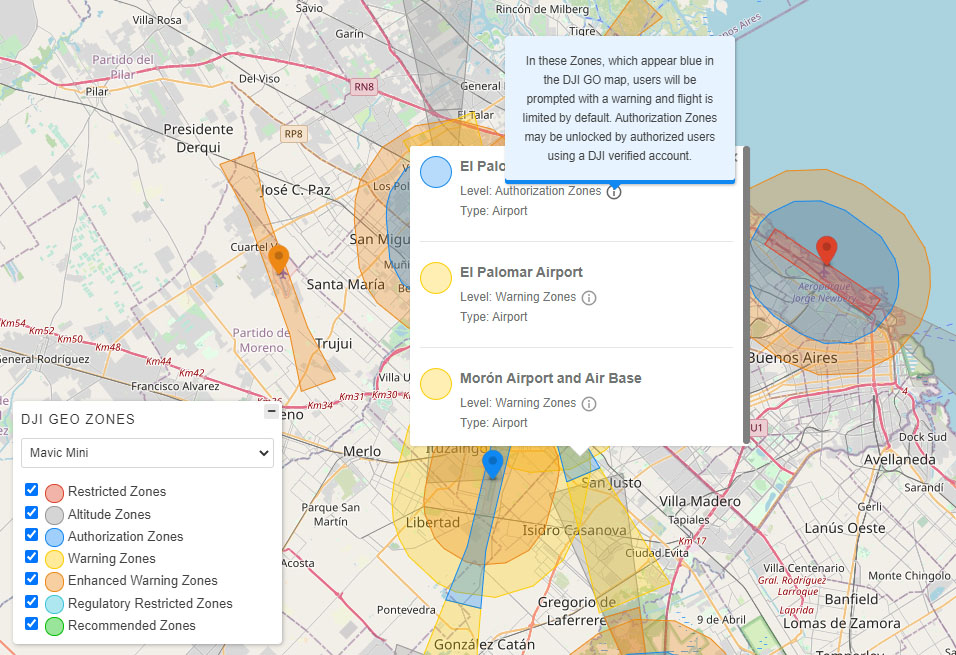
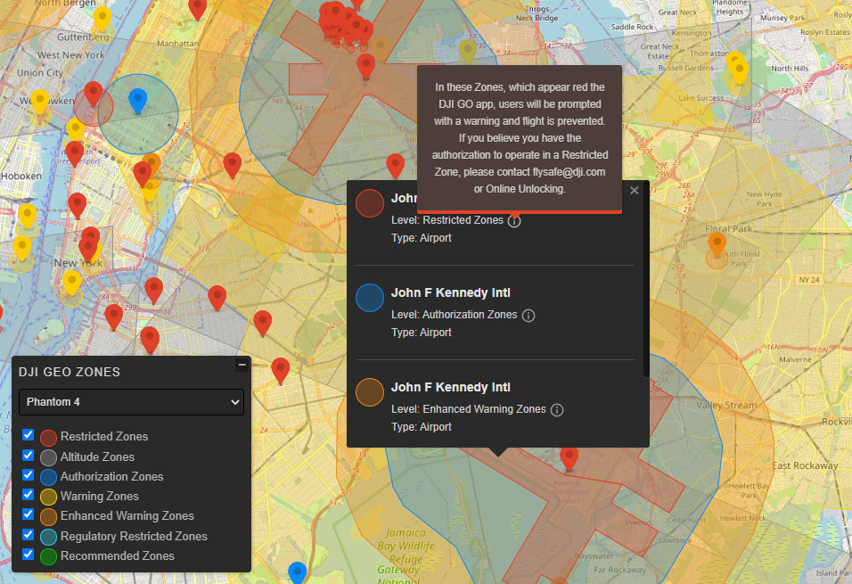

# OpenLayers DjiGeozones

Displays DJI Geo Zones on an OpenLayers map. Also, you can add a Control Panel with map legends and selectors to change the drone and the levels to be shown.

The data is obtained directly from an undocumented DJI [API](https://www-api.dji.com/api/geo/areas). The official DJI Fly Safe Geo Zone Map that use the same data can be found [here](https://www.dji.com/flysafe/geo-map).

Tested with OpenLayers version 5 and 6.

### DISCLAIMER

Nowadays, DJI doesn't offer any API documentation, so future support and access to the data is uncertain. Furthermore, the API endpoint has CORS restrictions, so all browsers requests must be proxied.




## Examples

All the examples are configured using a free Proxy. If you notice some lag or slow performance, try one of your own.

-   [Basic usage](https://raw.githack.com/GastonZalba/ol-dji-geozones/master/examples/basic.html)
    -   Create an OpenLayers map instance, and pass that map and options to the DjiGeozones constructor.

## Usage

```js
// Default values
let opt_options = {
    urlProxy: null,
    drone: 'spark', // See drone parameter in the DJI API section
    zonesMode: 'total', // See drone parameter in the DJI API section
    country: 'US', // See country parameter in the DJI API section
    levelsToDisplay: [2, 6, 1, 0, 3, 4, 7], // Order is kept in the Control Panel
    levelsActive: [2, 6, 1, 0, 3, 4, 7],
    dronesToDisplay: [], // By default, an array with all the drones
    extent: null,
    createPanel: true, // Create or not the control
    targetPanel: null, // Specify a target if you want the control to be rendered outside of the map's viewport.
    startCollapsed: false,
    clickEvent: 'singleclick',
    language: 'en',
    i18n: {} // Create customized languages/texts. See assets/i18n folder
};

// SETTING A REVERSE PROXY TO AVOID CORS
// This proxy url is a public demo of CORS Anywhere, use it only for testing.
// For production deploy a custom instance (visit https://github.com/Rob--W/cors-anywhere/)
// or use yor own proxy.
opt_options.urlProxy = 'https://cors-anywhere.herokuapp.com';

const djiGeozones = new DjiGeozones(map, opt_options);

// Instance methods
// This methods clean the loaded features and fires a new API request.
djiGeozones.drone = 'spark';
djiGeozones.country = 'US'; // At the moment, this doesn't seem to affect the api response
djiGeozones.zonesMode = 'total';

djiGeozones.activeLevels = [1, 2, 3, 4, 6, 7]; // Set custom level values
djiGeozones.addLevels(5);
djiGeozones.removeLevels(7);

djiGeozones.setPanelVisible(true); // Show/hide the control panel
djiGeozones.setPanelCollapsed(true); // Collapse/expand the control panel

djiGeozones.hide(); // Hide the GeoZones and the map Control
djiGeozones.show(); // Show the GeoZones and the map Control

let layers = djiGeozones.layers; // array of ol/layer/Vector~VectorLayer instances
let layer = djiGeozones.getLayerByLevel(7); // returns an ol/layer/Vector~VectorLayer instance with the specefic level
```

## [DJI API](https://www-api.dji.com/api/geo/areas) - What we know

### Some considerations

-   The API doesn't accepts requests in large zoom levels (&lt;9) aka search_radius, so the Geozones in the map are disabled in these zoom scales to manage this beahaivor.

-   The data returned by the API has some problems/strange behaviors:

    -   The elements in _level 6_ (Altitude Zones, grey color) are returning from the api with _level 2_ in the properties (Restricted Zones, red color), and the elements in _level 4_ (Regulatory Restricted Zones, light blue color) with _level 7_ (Recommended Zones, green color).
        This makes very messy the frontend, and make it impossible to filter these levels accordingly in each request. To avoid this problem, this module functions completely different from the official map: performs the API requests including all _levels_, distributing the results in differents layers according to each level, and filtering that manipulating the layers visibility (not by the API request).

-   See [DjiApi API](#DjiApi) for parameters and details.

## Changelog

See [CHANGELOG](./CHANGELOG.md) for details of changes in each release.

## Install

### Browser

#### JS

Load `ol-dji-geozones.js` after OpenLayers. Dji Geozone is available as `DjiGeozones`.

```HTML
<script src="https://unpkg.com/ol-dji-geozones@1.0.8"></script>
```

#### CSS

```HTML
<link rel="stylesheet" href="https://unpkg.com/ol-dji-geozones@1.0.8/dist/ol-dji-geozones.css" />
```

### Parcel, Webpack, etc.

NPM package: [ol-dji-geozones](https://www.npmjs.com/package/ol-dji-geozones).

#### JS

Install the package via `npm`

    npm install ol-dji-geozones --save-dev

#### CSS

The CSS file `ol-dji-geozones.css` can be found in `./node_modules/ol-dji-geozones/dist/css`

##### TypeScript type definition

TypeScript types are shipped with the project in the dist directory and should be automatically used in a TypeScript project. Interfaces are provided for DjiGeozones Options.

## API

<!-- Generated by documentation.js. Update this documentation by updating the source code. -->

#### Table of Contents

-   [DjiGeozones](#djigeozones)
    -   [Parameters](#parameters)
    -   [setPanelVisible](#setpanelvisible)
        -   [Parameters](#parameters-1)
    -   [setPanelCollapsed](#setpanelcollapsed)
        -   [Parameters](#parameters-2)
    -   [layers](#layers)
    -   [getLayerByLevel](#getlayerbylevel)
        -   [Parameters](#parameters-3)
    -   [drone](#drone)
        -   [Parameters](#parameters-4)
    -   [drone](#drone-1)
    -   [zonesMode](#zonesmode)
        -   [Parameters](#parameters-5)
    -   [zonesMode](#zonesmode-1)
    -   [country](#country)
        -   [Parameters](#parameters-6)
    -   [country](#country-1)
    -   [getLevelById](#getlevelbyid)
        -   [Parameters](#parameters-7)
    -   [activeLevels](#activelevels)
        -   [Parameters](#parameters-8)
    -   [addLevels](#addlevels)
        -   [Parameters](#parameters-9)
    -   [removeLevels](#removelevels)
        -   [Parameters](#parameters-10)
    -   [destroy](#destroy)
    -   [hide](#hide)
    -   [show](#show)
-   [ApiReqArguments](#apireqarguments)
    -   [level](#level)
    -   [drone](#drone-2)
    -   [country](#country-2)
    -   [zones_mode](#zones_mode)
    -   [lng](#lng)
    -   [lat](#lat)
    -   [search_radius](#search_radius)
-   [i18n](#i18n)
-   [Options](#options)
    -   [urlProxy](#urlproxy)
    -   [zonesMode](#zonesmode-2)
    -   [country](#country-3)
    -   [displayLevels](#displaylevels)
    -   [activeLevels](#activelevels-1)
    -   [dronesToDisplay](#dronestodisplay)
    -   [extent](#extent)
    -   [createPanel](#createpanel)
    -   [targetPanel](#targetpanel)
    -   [startCollapsed](#startcollapsed)
    -   [startActive](#startactive)
    -   [loadingElement](#loadingelement)
    -   [clickEvent](#clickevent)
    -   [theme](#theme)
    -   [language](#language)
    -   [i18n](#i18n-1)

### DjiGeozones

OpenLayers DJI Geozone, creates multiples VectorLayers to
display interactives DJI Geo Zones on the map, requesting the
data on the fly to an DJI API.

Also, add a Control to select levels of interest and drone to filter the results.

#### Parameters

-   `map` **[PluggableMap](https://openlayers.org/en/latest/apidoc/module-ol_PluggableMap-PluggableMap.html)** Instance of the created map
-   `opt_options` **[Options](#options)?** DjiGeozones options, see [DjiGeozones Options](#options) for more details.
-   `url_proxy` Proxy's url to avoid CORS protection in the API.

#### setPanelVisible

Show or hides the control panel

##### Parameters

-   `visible` **[boolean](https://developer.mozilla.org/docs/Web/JavaScript/Reference/Global_Objects/Boolean)**

Returns **void**

#### setPanelCollapsed

Collapse/expand the control panel

##### Parameters

-   `collapsed` **[boolean](https://developer.mozilla.org/docs/Web/JavaScript/Reference/Global_Objects/Boolean)**

Returns **void**

#### layers

Get all the layers

Type: [Array](https://developer.mozilla.org/docs/Web/JavaScript/Reference/Global_Objects/Array)&lt;VectorLayer>

Returns **[Array](https://developer.mozilla.org/docs/Web/JavaScript/Reference/Global_Objects/Array)&lt;VectorLayer>**

#### getLayerByLevel

Get the layer acordding the level

##### Parameters

-   `level` **[number](https://developer.mozilla.org/docs/Web/JavaScript/Reference/Global_Objects/Number)**

Returns **VectorLayer**

#### drone

Setter for API parameter `drone`. Triggers an API request

Type: [string](https://developer.mozilla.org/docs/Web/JavaScript/Reference/Global_Objects/String)

##### Parameters

-   `drone` **[string](https://developer.mozilla.org/docs/Web/JavaScript/Reference/Global_Objects/String)**

#### drone

Getter for Api parameter drone

Type: [string](https://developer.mozilla.org/docs/Web/JavaScript/Reference/Global_Objects/String)

Returns **[string](https://developer.mozilla.org/docs/Web/JavaScript/Reference/Global_Objects/String)**

#### zonesMode

Setter for API parameter `zonesMode`. Triggers an API request

Type: [string](https://developer.mozilla.org/docs/Web/JavaScript/Reference/Global_Objects/String)

##### Parameters

-   `zonesMode` **[string](https://developer.mozilla.org/docs/Web/JavaScript/Reference/Global_Objects/String)**

#### zonesMode

Getter for API parameter `zonesMode`

Type: [string](https://developer.mozilla.org/docs/Web/JavaScript/Reference/Global_Objects/String)

Returns **[string](https://developer.mozilla.org/docs/Web/JavaScript/Reference/Global_Objects/String)**

#### country

Setter for API parameter `country`. Triggers an API request

Type: [string](https://developer.mozilla.org/docs/Web/JavaScript/Reference/Global_Objects/String)

##### Parameters

-   `country` **[string](https://developer.mozilla.org/docs/Web/JavaScript/Reference/Global_Objects/String)**

#### country

Getter for API parameter `country`

Type: [string](https://developer.mozilla.org/docs/Web/JavaScript/Reference/Global_Objects/String)

Returns **[string](https://developer.mozilla.org/docs/Web/JavaScript/Reference/Global_Objects/String)**

#### getLevelById

Get all the parameters from a level and the i18n texts

##### Parameters

-   `id` **[number](https://developer.mozilla.org/docs/Web/JavaScript/Reference/Global_Objects/Number)** (optional, default `null`)

Returns **Level**

#### activeLevels

Replace the active levels with this values and refresh the view

Type: [Array](https://developer.mozilla.org/docs/Web/JavaScript/Reference/Global_Objects/Array)&lt;[number](https://developer.mozilla.org/docs/Web/JavaScript/Reference/Global_Objects/Number)>

##### Parameters

-   `levels` **[Array](https://developer.mozilla.org/docs/Web/JavaScript/Reference/Global_Objects/Array)&lt;[number](https://developer.mozilla.org/docs/Web/JavaScript/Reference/Global_Objects/Number)>**

#### addLevels

Add the level/s to the view

##### Parameters

-   `levels` **([Array](https://developer.mozilla.org/docs/Web/JavaScript/Reference/Global_Objects/Array)&lt;[number](https://developer.mozilla.org/docs/Web/JavaScript/Reference/Global_Objects/Number)> | [number](https://developer.mozilla.org/docs/Web/JavaScript/Reference/Global_Objects/Number))**
-   `refresh` If true, refresh the view and show the active levels (optional, default `true`)

Returns **void**

#### removeLevels

Remove the level/s from the view

##### Parameters

-   `levels` **([Array](https://developer.mozilla.org/docs/Web/JavaScript/Reference/Global_Objects/Array)&lt;[number](https://developer.mozilla.org/docs/Web/JavaScript/Reference/Global_Objects/Number)> | [number](https://developer.mozilla.org/docs/Web/JavaScript/Reference/Global_Objects/Number))**
-   `refresh` If true, refresh the view and show the actived levels (optional, default `true`)

Returns **void**

#### destroy

Removes the control, layers and events from the map

Returns **void**

#### hide

Hide the geoZones and the Control

Returns **void**

#### show

Show the geoZones nd the Control

Returns **void**

### ApiReqArguments

**_[interface]_** - Dji Api Parameters for requests

#### level

-   `0` - Warning Zones
-   `1` - Authorization Zones
-   `2` - Restricted Zones
-   `3` - Enhanced Warning Zones
-   `4` - Regulatory Restricted Zones
-   `5` - Recommended Zones (2) **Apparently this level is only valid for Japan**
-   `6` - Altitude Zones
-   `7` - Recommended Zones
-   `8` - Approved Zones for Light UAVs(China) **Only valid for China**
-   `9` - Densely Populated Area **NOT SUPPORTED - This level exists in the oficial Geo Zone Map, but this data is not provided by the api. On the other hand, now days this level is apparently valid only for Japan and China**

Type: [Array](https://developer.mozilla.org/docs/Web/JavaScript/Reference/Global_Objects/Array)&lt;[number](https://developer.mozilla.org/docs/Web/JavaScript/Reference/Global_Objects/Number)>

#### drone

-   `mavic-mini` (Mavic Mini)
-   `mavic-2-enterprise` (Mavic 2 Enterprise)
-   `mavic-2` (Mavic 2)
-   `mavic-air` (Mavic Air)
-   `mavic-air-2` (Mavic Air 2)
-   `mavic-pro` (Mavic Pro)
-   `spark` (Spark)
-   `phantom-4-pro` (Phantom 4 Pro)
-   `phantom-4-advanced` (Phantom 4 Advanced)
-   `phantom-4` (Phantom 4)
-   `phantom-4-rtk` (Phantom 4 RTK)
-   `phantom-4-multispectral` (Phantom 4 Multispectral)
-   `phantom-3-pro` (Phantom 3 Pro
-   `phantom-3-advanced` (Phantom 3 Advanced)
-   `phantom-3-standard` (Phantom 3 Standard)
-   `phantom-3-4K` (Phantom 3 4K)
-   `phantom-3-se` (Phantom 3 SE)
-   `inspire-2` (Inspire 2)
-   `inspire-1-series` (Inspire 1 Series)
-   `m200-series` (M200 Series)
-   `m300-series` (M300 Series)
-   `m600-series` (M600 Series)
-   `m100` (M100)
-   `mg1p` (MG 1S/1A/1P/1P RTK/T10/T16/T20/T30)
-   `dji-mini-2` (DJI Mini 2)

Type: [string](https://developer.mozilla.org/docs/Web/JavaScript/Reference/Global_Objects/String)

#### country

Apparently doesn't affects the response of the api

-   `US`
-   `AR`
-   _etc_ ([See the supported list](https://www.dji.com/flysafe/geo-map))

Type: [string](https://developer.mozilla.org/docs/Web/JavaScript/Reference/Global_Objects/String)

#### zones_mode

Apparently only accepts 'total'

Type: [string](https://developer.mozilla.org/docs/Web/JavaScript/Reference/Global_Objects/String)

#### lng

Map View center point Longitude

Type: [number](https://developer.mozilla.org/docs/Web/JavaScript/Reference/Global_Objects/Number)

#### lat

Map View center point Latitude

Type: [number](https://developer.mozilla.org/docs/Web/JavaScript/Reference/Global_Objects/Number)

#### search_radius

Radius of the current view of the map

Type: [number](https://developer.mozilla.org/docs/Web/JavaScript/Reference/Global_Objects/Number)

### i18n

**_[interface]_** - Custom Language specified when creating a DjiGeozones

### Options

**_[interface]_** - DjiGeozones Options specified when creating a DjiGeozones instance

Default values:

```javascript
{
  drone: 'spark', // See parameter in the DJI API section
  zonesMode: 'total', // See parameter in the DJI API section
  country: 'US', // See parameter in the DJI API section
  displayLevels: [2, 6, 1, 0, 3, 4, 7],
  activeLevels: [2, 6, 1, 0, 3, 4, 7],
  createPanel: true,
  targetPanel: null,
  startCollapsed: true,
  startActive: true,
  extent: null,
  loadingElement: '<div class="lds-ellipsis"><div></div><div></div><div></div><div></div></div>',
  clickEvent: 'singleclick',
  language: 'en',
  i18n: null
}
```

#### urlProxy

Url/endpoint from a Reverse Proxy to avoid CORS restrictions

Type: [string](https://developer.mozilla.org/docs/Web/JavaScript/Reference/Global_Objects/String)

#### zonesMode

zonesMode to be used in the API request

Type: [string](https://developer.mozilla.org/docs/Web/JavaScript/Reference/Global_Objects/String)

#### country

Country identifier to be used in the API request

Type: [string](https://developer.mozilla.org/docs/Web/JavaScript/Reference/Global_Objects/String)

#### displayLevels

Geozone Levels to be shown in the control panel

Type: [Array](https://developer.mozilla.org/docs/Web/JavaScript/Reference/Global_Objects/Array)&lt;[number](https://developer.mozilla.org/docs/Web/JavaScript/Reference/Global_Objects/Number)>

#### activeLevels

Geozone Levels to be actived by default in the Control and API request

Type: [Array](https://developer.mozilla.org/docs/Web/JavaScript/Reference/Global_Objects/Array)&lt;[number](https://developer.mozilla.org/docs/Web/JavaScript/Reference/Global_Objects/Number)>

#### dronesToDisplay

Use a custom drone list to show in the select.
See [drone](#drone-2) for the complete list.

Type: [Array](https://developer.mozilla.org/docs/Web/JavaScript/Reference/Global_Objects/Array)&lt;Drone>

#### extent

The bounding extent for layer rendering.
The layers will not be rendered outside of this extent.

Type: Extent

#### createPanel

Display or hide the control panel on the map

Type: [boolean](https://developer.mozilla.org/docs/Web/JavaScript/Reference/Global_Objects/Boolean)

#### targetPanel

Specify a target if you want the control to be rendered outside of the map's viewport.

Type: ([HTMLElement](https://developer.mozilla.org/docs/Web/HTML/Element) \| [string](https://developer.mozilla.org/docs/Web/JavaScript/Reference/Global_Objects/String))

#### startCollapsed

Whether panel is minimized when created. Defaults to false.

Type: `false`

#### startActive

Show GeoZones on initialize

Type: [boolean](https://developer.mozilla.org/docs/Web/JavaScript/Reference/Global_Objects/Boolean)

#### loadingElement

Loading element to be shown in the Controller when loading API data

Type: [string](https://developer.mozilla.org/docs/Web/JavaScript/Reference/Global_Objects/String)

#### clickEvent

Type of Click event to activate the PopUp

Type: (`"singleclick"` \| `"dblclick"`)

#### theme

Color theme of the Control Panel

Type: (`"light"` \| `"dark"`)

#### language

Language to be used in the Controller panel and PopUp. This doesn't affects the API requests.
If i18n is set, this will be ignored.

Type: (`"en"` \| `"es"`)

#### i18n

Add custom translations. If this is provided, language will be ignored.

Type: [i18n](#i18n)

## TODO

-   Add test to check inexpected changes on the API response.

## License

MIT (c) Gastón Zalba.
